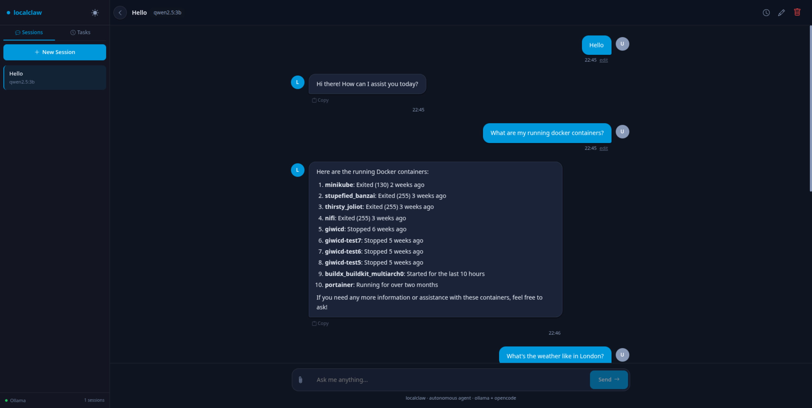
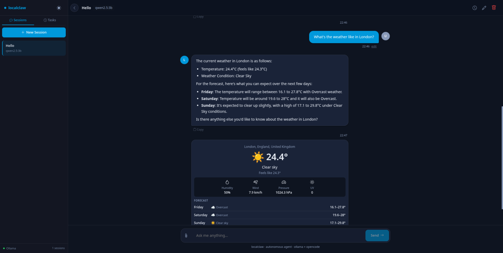
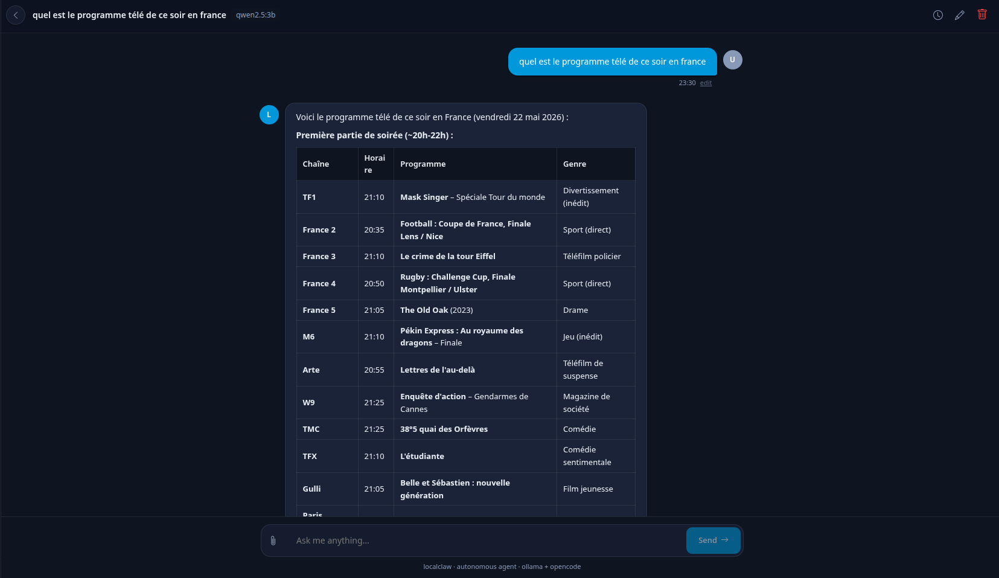

# localclaw

<p align="center">
  
</p>

Autonomous AI agent powered by Ollama + OpenCode. Runs locally, creates its own tools, searches the web, executes code, and delegates complex tasks — all through a chat UI or REST API.

<p align="center">
    
</p>

## Quick Start

**Prerequisites:** Node.js 22+, Ollama with a model pulled, [OpenCode](https://opencode.ai) CLI, Docker (optional).

```bash
docker compose up -d           # SearXNG (optional)
npm install && cd client && npm install && cd ..
npm run setup:opencode          # Configure OpenCode
npm run dev                     # http://localhost:4173
```

## Configuration

All settings via `.env`. See `.env.example` for the full template.

| Variable | Default | Description |
|---|---|---|
| `LOCALCLAW_PORT` | `4173` | Server port |
| `LOCALCLAW_OLLAMA_URL` | `http://localhost:11434` | Ollama API URL |
| `LOCALCLAW_MODEL` | `ollama/qwen2.5:7b-instruct-q3_K_M` | Default model |
| `LOCALCLAW_OPENCODE_API_KEY` | — | Anthropic API key (optional, enables Claude) |
| `LOCALCLAW_SEARXNG_URL` | `http://localhost:8888` | SearXNG (empty = DuckDuckGo) |
| `LOCALCLAW_API_KEY` | — | Bearer token auth for REST + WebSocket |
| `LOCALCLAW_MAILGUN_API_KEY` | — | Mailgun for email |
| `LOCALCLAW_TELEGRAM_BOT_TOKEN` | — | Telegram bot |
| `LOCALCLAW_SANDBOX_ENABLED` | `false` | Docker sandbox for code execution |
| `LOCALCLAW_EMBEDDING_MODEL` | `nomic-embed-text` | Embedding model for RAG |
| `LOCALCLAW_LOG_LEVEL` | `info` | `debug`, `info`, `warn`, `error` |
| `LOCALCLAW_HTTPS_KEY` / `_CERT` | — | Paths for HTTPS |

## Architecture

See [docs/architecture.md](docs/architecture.md) for the full agent loop, pre-planning pipeline, failure handling, and database schema.

## Built-in Tools

See [docs/tools.md](docs/tools.md) for parameter tables and the `ToolResult` widget pattern.

| Tool | Description |
|---|---|
| `web_fetch` | Web search (SearXNG or DuckDuckGo) + URL fetch |
| `fetch_news` | News articles via SearXNG news / RSS |
| `weather` | Current + 3-day forecast (Open-Meteo, no API key) |
| `read_file` / `write_file` | Local filesystem access |
| `run_bash` | Bash execution with streaming output |
| `opencode_task` | Delegate complex coding to OpenCode |
| `generate_image` | Image generation via Ollama |
| `send_email` | Email via Mailgun |
| `send_telegram` | Telegram bot messaging |
| `schedule_task` | Schedule recurring background tasks |
| `search_knowledge` | RAG knowledge base search |
| `browser_automation` | Headless Chromium (Puppeteer) |
| `create_tool` | Generate tools on the fly (JS/Python/Bash) |

## API

See [docs/api.md](docs/api.md) for the full REST endpoint table and WebSocket streaming protocol.

## Security

**Auth** — `LOCALCLAW_API_KEY` enables Bearer token auth on all REST endpoints and WebSocket.
**Command blocklist** — destructive commands (`rm -rf /`, `mkfs`, fork bombs) blocked before execution.
**Sandbox** — `LOCALCLAW_SANDBOX_ENABLED=true` wraps code in Docker (`--network none`, `--cap-drop ALL`). See [docs/sandbox.md](docs/sandbox.md).
**Path traversal** — `read_file`/`write_file` validate paths against the data directory.
**Audit log** — every tool call recorded in `tool_calls` table.

## Features

| Feature | Docs |
|---|---|
| Agent loop + pre-planning + failure handling | [docs/architecture.md](docs/architecture.md) |
| Database schema (10 tables, FTS5, cache) | [docs/database.md](docs/database.md) |
| ToolResult widgets (structured UI rendering) | [docs/tools.md](docs/tools.md) |
| Plugin system (JS/ESM + npm packages) | [docs/plugins.md](docs/plugins.md) |
| Background tasks (schedule, retry, execution log) | [docs/architecture.md](docs/architecture.md) |
| RAG memory + knowledge base | [docs/architecture.md](docs/architecture.md) |
| System prompt engineering | [docs/system-prompt.md](docs/system-prompt.md) |
| Docker sandbox configuration | [docs/sandbox.md](docs/sandbox.md) |
| Test suite (vitest, 13 files) | [docs/testing.md](docs/testing.md) |
| GPU acceleration (NVIDIA CUDA, AMD Vulkan) | [docs/configuration.md](docs/configuration.md) |

## Services

**OpenCode** — CLI agent for complex tasks and dynamic tool creation. Set `LOCALCLAW_OPENCODE_API_KEY` for Claude-powered OpenCode; falls back to local Ollama otherwise.

**Email** — [Mailgun](https://documentation.mailgun.com/) API for email delivery. Sandbox domains require authorized recipients in Mailgun Dashboard.

**Telegram** — Send messages via bot. Call `get_chat_id` to discover your chat ID, then omit `chat_id` if `LOCALCLAW_TELEGRAM_CHAT_ID` is set.

**Web Search** — SearXNG (Docker) with JSON API; falls back to DuckDuckGo HTML search.

## Production

```bash
npm run build          # Server (tsc) + client (ng build)
npm start              # Production server on :4173
npm test               # vitest (server), ng test (client)
docker build -t localclaw .
```

### Docker Stack

```bash
docker compose up -d
docker exec localclaw-ollama ollama pull qwen2.5:7b-instruct-q3_K_M
docker exec localclaw-ollama ollama pull nomic-embed-text
# Open http://localhost:4173
```

**GPU**: NVIDIA GPU reservations in compose. For AMD, remove `deploy.resources` and set `OLLAMA_VULKAN=1`.

## Frontend

Angular 20 SPA with WebSocket streaming, markdown rendering (highlight.js), light/dark themes, collapsible tool cards, message editing, file upload, session/task management, and weather widget. See [client/README.md](client/README.md).

## GPU Acceleration

Ollama supports NVIDIA CUDA and AMD Vulkan/ROCm. Verify with `ollama ps` (look for "100% GPU"). Models must fit in VRAM — use quantized versions like `q3_K_M` for 4GB cards. For AMD, upgrade to a Vulkan-capable Ollama build and set `OLLAMA_VULKAN=1`.
