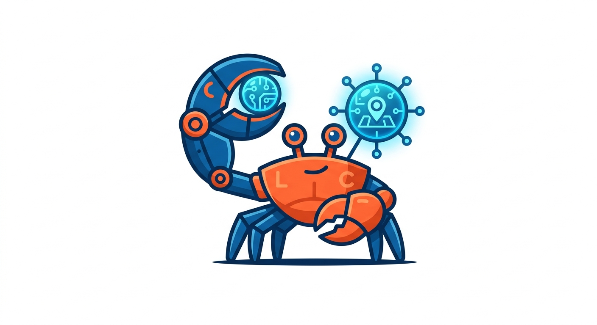

# localclaw

<p align="center">
  
</p>

Autonomous AI agent powered by Ollama + OpenCode. Runs locally, creates its own tools, searches the web, executes code, and delegates complex tasks — all through a chat UI or REST API.

## Architecture

```
localclaw/
├── src/
│   ├── index.ts           # Express server + HTTP/HTTPS server entry point
│   ├── ws.ts              # WebSocket server (replaces SSE for chat streaming)
│   ├── agent.ts           # Agent loop — Ollama function calling, tool execution, persistence
│   ├── api.ts             # REST API routes (sessions, messages, uploads, knowledge)
│   ├── auth.ts            # Bearer token auth middleware (optional)
│   ├── db.ts              # SQLite sessions, messages, memories, FTS5, background tasks, audit log
│   ├── plugins.ts         # Plugin scanner (JS/ESM files + npm packages)
│   ├── log.ts             # Structured logger with levels (debug/info/warn/error)
│   ├── ollama.ts          # Ollama API client (streaming + non-streaming)
│   ├── opencode.ts        # OpenCode subprocess delegation
│   ├── embeddings.ts      # Ollama embeddings API for RAG memory
│   ├── scheduler.ts       # Background task scheduler (polls every 30s)
│   └── tools/
│       ├── types.ts        # Tool type definitions + AgentEvent
│       ├── registry.ts     # Tool registry — builtins + dynamic create_tool
│       └── builtin/
│           ├── web-fetch.ts           # Web search (SearXNG / DuckDuckGo) + URL fetch
│           ├── fetch-news.ts          # News search (SearXNG news + RSS feeds)
│           ├── read-file.ts           # Local file reading (path traversal protected)
│           ├── write-file.ts          # Local file writing (path traversal protected)
│           ├── run-bash.ts            # Bash command execution (streaming output)
│           ├── opencode-task.ts       # OpenCode delegation
│           ├── generate-image.ts      # Image generation via Ollama
│           ├── schedule-task.ts       # Background task scheduling
│           ├── send-email.ts          # Email delivery via Mailgun
│           ├── send-telegram.ts       # Telegram bot messaging
│           ├── weather.ts             # Weather forecast (wttr.in / Open-Meteo)
│           ├── search-knowledge.ts    # RAG knowledge base search
│           └── browser-automation.ts  # Headless Chromium browser control
├── client/                 # Angular 20 frontend (SPA)
├── searxng/
│   └── settings.yml        # SearXNG config (JSON API + image proxy)
├── plugins/                # Bundled plugin directory
├── docker-compose.yml      # Ollama + SearXNG + localclaw stack
├── Dockerfile              # Production build
├── .env                    # Configuration (gitignored)
├── .env.example            # Documented configuration template
```

## Quick Start

**Prerequisites:** Node.js 22+, Ollama with a model pulled (e.g. `qwen2.5:7b-instruct-q3_K_M`), [OpenCode](https://opencode.ai) CLI, Docker (optional, for SearXNG).

```bash
# 1. Start SearXNG (optional — falls back to DuckDuckGo)
docker compose up -d

# 2. Install dependencies
npm install && cd client && npm install && cd ..

# 3. Configure OpenCode for Ollama
npm run setup:opencode

# 4. Start development server
npm run dev
```

Open http://localhost:4173

## GPU Acceleration

Ollama supports GPU acceleration via CUDA (NVIDIA) or ROCm/Vulkan (AMD). localclaw inherits whatever backend Ollama is configured with.

**AMD GPUs (RX 580, etc.) — Vulkan path (recommended):**

```bash
# 1. Install Mesa Vulkan drivers (usually pre-installed)
sudo apt install mesa-vulkan-drivers

# 2. Upgrade Ollama to a Vulkan-capable build
sudo systemctl stop ollama
curl -L https://github.com/ollama/ollama/releases/latest/download/ollama-linux-amd64 -o /usr/local/bin/ollama
sudo chmod +x /usr/local/bin/ollama
sudo systemctl start ollama

# 3. Set Vulkan environment in Ollama service
# Add to /etc/systemd/system/ollama.service.d/override.conf:
# Environment=OLLAMA_VULKAN=1
```

**Verify GPU is active:**
```bash
ollama ps
# Look for "100% GPU" in the PROCESSOR column
```

> **Note:** Models must fit in VRAM to run entirely on GPU. With a 4GB RX 580, use quantized models like `qwen2.5:7b-instruct-q3_K_M` (~3.6GB) instead of the full q4_K_M variant (~4.7GB).

## Configuration

All settings via `.env`:

| Variable | Default | Description |
|---|---|---|
| `LOCALCLAW_PORT` | `4173` | Server port |
| `LOCALCLAW_DATA_DIR` | `~/.localclaw` | Data directory (sessions, tools, downloads) |
| `LOCALCLAW_OLLAMA_URL` | `http://localhost:11434` | Ollama API URL |
| `LOCALCLAW_MODEL` | `ollama/qwen2.5:7b-instruct-q3_K_M` | Default model |
| `LOCALCLAW_SEARXNG_URL` | `http://localhost:8888` | SearXNG search URL (empty = DuckDuckGo fallback) |
| `LOCALCLAW_OPENCODE_BIN` | `opencode` | OpenCode binary path |
| `LOCALCLAW_OPENCODE_API_KEY` | — | Anthropic API key for OpenCode cloud models (optional) |
| `LOCALCLAW_LOG_LEVEL` | `info` | Log level: `debug`, `info`, `warn`, `error` |
| `LOCALCLAW_SANDBOX_ENABLED` | `false` | Wrap code execution in Docker containers |
| `LOCALCLAW_SANDBOX_IMAGE` | `ubuntu:22.04` | Docker image for sandboxed execution |
| `LOCALCLAW_EMBEDDING_MODEL` | `nomic-embed-text` | Embedding model for RAG memory |
| `LOCALCLAW_MAILGUN_API_KEY` | — | Mailgun API key for email delivery |
| `LOCALCLAW_MAILGUN_DOMAIN` | — | Mailgun verified domain |
| `LOCALCLAW_MAILGUN_FROM` | — | Sender email address |
| `LOCALCLAW_TELEGRAM_BOT_TOKEN` | — | Telegram bot token for messaging |
| `LOCALCLAW_TELEGRAM_CHAT_ID` | — | Default Telegram chat ID for notifications |
| `LOCALCLAW_API_KEY` | — | API key for Bearer token auth on REST endpoints (optional) |
| `LOCALCLAW_HTTPS_KEY` | — | Path to TLS private key for HTTPS (optional) |
| `LOCALCLAW_HTTPS_CERT` | — | Path to TLS certificate for HTTPS (optional) |

## How It Works

1. User sends a message via the Angular UI or REST API
2. The agent loop sends the conversation + available tools to Ollama
3. Ollama responds with either text or tool calls
4. Tool calls are executed (web search, file ops, bash, etc.)
5. Results are fed back to Ollama for the next reasoning step
6. The loop continues until the agent produces a final answer (up to 15 iterations)

### Built-in Tools

- **web_fetch** — Search the web (SearXNG → DuckDuckGo) or fetch a specific URL. Supports `text`, `images`, and `download` modes. Validates domain existence before fetching.
- **fetch_news** — Fetch the latest news articles on any topic. Uses SearXNG news search or RSS feeds (BBC, TechCrunch, Hacker News) as fallback.
- **generate_image** — Generate images using Ollama image models (flux, sd, stable-diffusion). Saves to downloads directory.
- **read_file** / **write_file** — Read and write files on the local filesystem.
- **run_bash** — Execute any bash command with real-time output streaming (120s timeout). Respects sandbox mode when enabled.
- **opencode_task** — Delegate complex multi-step coding tasks to OpenCode.
- **send_email** — Send email via Mailgun API. Supports plain text and HTML. Combine with background tasks for recurring delivery.
- **send_telegram** — Send Telegram messages via bot. Includes a `get_chat_id` helper to discover chat IDs. Combine with background tasks for recurring notifications.
- **browser_automation** — Control a headless Chromium browser (via Puppeteer). Navigate URLs, click elements, extract page content, take screenshots, and fill forms.
- **weather** — Get current weather and forecasts for any location. Uses wttr.in with Open-Meteo fallback.
- **search_knowledge** — Search the local RAG knowledge base (uploaded documents + past tool results). Supports keyword and semantic search modes.
- **schedule_task** — Schedule, unschedule, and list background tasks. Supports `every Xm`, `every Xh`, `daily at HH:MM`, `daily`, `weekly` schedules.
- **create_tool** — Dynamically create new reusable tools in JavaScript, Python, or Bash. Execution respects sandbox mode.

### RAG Memory

Tool results are automatically embedded (via Ollama embeddings API) and stored in SQLite. At the start of each conversation turn, the agent retrieves semantically relevant past tool results and injects them into the system prompt — enabling cross-session memory without filling the context window.

### Security

**API authentication** — When `LOCALCLAW_API_KEY` is set, all REST endpoints (except `/api/health`) require a `Bearer <token>` header. Protects the agent from unauthorized access in exposed deployments.

**Command blocklist** — The `run_bash` tool blocks potentially destructive commands (`rm -rf /`, `mkfs`, `dd if=/dev/zero`, fork bombs, etc.) before execution.

**Shell injection prevention** — Dynamic tools (JavaScript/Python) created via `create_tool` are executed with `execFileSync` instead of a shell, removing shell injection vectors. Bash tools still need a shell but pass through the command blocklist.

**Audit log** — Every tool call is recorded in the `tool_calls` SQLite table with session, tool name, arguments, result/error, and duration for post-hoc inspection.

**Path traversal protection** — `read_file` / `write_file` tools validate paths against the data directory to prevent directory traversal.

### Code Execution Sandbox

When `LOCALCLAW_SANDBOX_ENABLED=true`, `run_bash` and `create_tool` executions are wrapped in Docker containers with `--network none`, `--security-opt no-new-privileges`, and `--cap-drop ALL` for safe code execution.

### Image Generation

The `generate_image` tool calls Ollama's `/api/generate` with image models (flux, sd, etc.). Generated images are saved to the downloads directory and returned as URLs.

### Persistence & Resilience

The agent re-prompts itself when:
- A tool returns weak results (`No results`, `not found`, `Error:`, `< 30 chars`)
- The model gives up with phrases like `cannot find`, `does not contain`, `pas directement`
- The model responds with advisory text instead of using tools

### Background Tasks

Long-running and recurring tasks are handled by `BackgroundScheduler` (`src/scheduler.ts`), which polls the database every 30 seconds for due tasks. The agent can schedule tasks using the `schedule_task` tool:

```
schedule_task({ action: "schedule", name: "Morning news", schedule: "daily at 08:00", tool: "fetch_news", args: '{"topic":"technology"}' })
schedule_task({ action: "schedule", name: "Email report", schedule: "every 24h", tool: "send_email", args: '{"to":"user@example.com","subject":"Daily report","body":"..."}' })
schedule_task({ action: "list" })
schedule_task({ action: "unschedule", task_id: "..." })
```

When a background task completes, the result is stored in the database and injected as a system message into the session — the agent sees it on the next conversation turn.

### Email Delivery

The `send_email` tool uses the [Mailgun API](https://documentation.mailgun.com/) to send emails. Configure in `.env`:

```
LOCALCLAW_MAILGUN_API_KEY=your-api-key
LOCALCLAW_MAILGUN_DOMAIN=your-domain.mailgun.org
LOCALCLAW_MAILGUN_FROM=localclaw <mailgun@your-domain.mailgun.org>
```

**Sandbox domains** require authorized recipients — add the target email in Mailgun Dashboard → Sending → Authorized Recipients.

### Telegram Bot

The `send_telegram` tool sends messages via a Telegram bot. Configure in `.env`:

```
LOCALCLAW_TELEGRAM_BOT_TOKEN=your-bot-token
LOCALCLAW_TELEGRAM_CHAT_ID=your-chat-id   # optional — used as fallback
```

Usage:
1. Message your bot on Telegram
2. Call `send_telegram({ action: "get_chat_id" })` to discover your chat ID
3. Call `send_telegram({ action: "send", chat_id: "123456", text: "Hello!" })` to send messages

If `LOCALCLAW_TELEGRAM_CHAT_ID` is set in `.env`, the `chat_id` argument can be omitted — the tool falls back to the env var automatically.

### OpenCode

[OpenCode](https://opencode.ai) is a CLI coding agent that localclaw delegates complex multi-file coding tasks to. Configure the binary path and API key in `.env`:

```
LOCALCLAW_OPENCODE_BIN=opencode
LOCALCLAW_OPENCODE_API_KEY=sk-ant-...   # optional — enables Anthropic Claude models
```

When `LOCALCLAW_OPENCODE_API_KEY` is set, it is forwarded to OpenCode as `ANTHROPIC_API_KEY` and the `setup:opencode` script adds an Anthropic provider entry to the OpenCode config. Without it, OpenCode uses the local Ollama provider only.

Run `npm run setup:opencode` to initialise the OpenCode config file at `~/.config/opencode/opencode.json`.

### Web Search

Primary backend is SearXNG (Docker container on port 8888) with custom `settings.yml` that enables JSON API and image-focused engines (Pixabay, Flickr, DeviantArt, Getty, Openverse). Falls back to DuckDuckGo HTML search if SearXNG is not configured.

## API

All API routes (except `/api/health`) require authentication when `LOCALCLAW_API_KEY` is set. Pass the key as a Bearer token:

```
Authorization: Bearer <your-api-key>
```

| Method | Path | Description |
|---|---|---|
| `GET` | `/api/health` | Health check |
| `GET` | `/api/tools` | List registered tools |
| `GET` | `/api/sessions` | List sessions |
| `POST` | `/api/sessions` | Create session |
| `GET` | `/api/sessions/:id` | Get session |
| `DELETE` | `/api/sessions/:id` | Delete session |
| `PATCH` | `/api/sessions/:id` | Rename session |
| `GET` | `/api/sessions/:id/messages` | Get messages |
| `PATCH` | `/api/sessions/:id/messages/:msgId` | Edit message (truncates conversation after it) |
| `POST` | `/api/sessions/:id/upload` | Upload file (txt/pdf/docx) for chat context |
| `GET` | `/api/background-tasks` | List background tasks (used by the UI Tasks tab) |
| `GET` | `/api/background-tasks/:id` | Get a background task |
| `DELETE` | `/api/background-tasks/:id` | Delete a background task |
| `PATCH` | `/api/background-tasks/:id` | Enable/disable (pause/resume) a background task |
| `GET` | `/api/knowledge` | List uploaded knowledge documents |
| `DELETE` | `/api/knowledge/:id` | Delete a knowledge document |

### Chat Streaming (WebSocket)

Connect to `ws://host/ws` and send a JSON message:

```json
{"type":"chat","sessionId":"<uuid>","message":"Hello!"}
```

The server streams events back as JSON messages:

```
{"type":"text","content":"thinking..."}
{"type":"tool_start","toolName":"web_fetch","toolRunId":"<uuid>","toolArgs":{...}}
{"type":"tool_chunk","toolName":"web_fetch","toolRunId":"<uuid>","content":"stdout line 1..."}
{"type":"tool_end","toolName":"web_fetch","toolRunId":"<uuid>","toolResult":"..."}
{"type":"tool_error","toolName":"web_fetch","toolRunId":"<uuid>","error":"..."}
{"type":"text","content":"final answer"}
{"type":"done"}
```

Each tool invocation gets a unique `toolRunId` so concurrent or repeated tool calls are matched correctly in the UI. Tool execution output is streamed in real-time via `tool_chunk` events.

**Development proxy:** When using `ng serve`, the Angular dev server proxies `/ws` to the backend. Configured in `client/proxy.conf.js`.

**Stop generation:** Close the WebSocket from the client side — the backend detects `req.on('close')` and aborts the agent loop.

## Production Build

```bash
npm run build    # Builds both server (tsc) and client (ng build)
npm start        # Start production server
npm test         # Run unit tests (vitest)
docker build -t localclaw .   # Or build Docker image
```

## Docker Stack (Recommended)

The fastest way to run everything (Ollama + localclaw + SearXNG):

```bash
# 1. Clone and enter the repo
cd localclaw

# 2. Start the full stack
docker compose up -d

# 3. Pull a model in Ollama
docker exec localclaw-ollama ollama pull qwen2.5:7b-instruct-q3_K_M
docker exec localclaw-ollama ollama pull nomic-embed-text

# 4. Open http://localhost:4173
```

**GPU support**: The Ollama container is configured with NVIDIA GPU reservations. For AMD GPUs, remove the `deploy.resources` block and set `OLLAMA_VULKAN=1` in the ollama service environment — requires `runtime: runc` or native Vulkan support on the host.

**Configuration**: Pass variables via `.env` in the project root — values are picked up by `docker compose`:

| Variable | Default | Description |
|---|---|---|
| `LOCALCLAW_PORT` | `4173` | Host port for the web UI |
| `LOCALCLAW_MODEL` | `ollama/qwen2.5:7b-instruct-q3_K_M` | Default chat model |
| `LOCALCLAW_EMBEDDING_MODEL` | `nomic-embed-text` | Embedding model for RAG |
| `SEARXNG_SECRET_KEY` | `change_me` | SearXNG secret key |

To update the stack after pulling new code:

```bash
docker compose down
git pull
docker compose build localclaw
docker compose up -d
```

## Frontend

Angular 20 single-page application (signals-based) with:
- WebSocket-based real-time chat streaming with tool event matching per `toolRunId`
- Markdown rendering with syntax highlighting (highlight.js, atom-one-dark theme)
- 2 themes: Light and Dark with auto-detection via `prefers-color-scheme`
- Collapsible tool event cards showing real-time agent activity (streaming chunks via `tool_chunk`)
- Stop generation button (closes WebSocket, aborts agent loop)
- Message editing — edit any user message, conversation is truncated after the edit point
- File upload — attach text/PDF/docx files via paperclip icon, content extracted and added as user message
- Session management — create, rename, delete sessions
- Background task management — list, pause/resume, and delete scheduled tasks in a dedicated Tasks tab
- Toast notifications for errors and confirmations
- Copy button on code blocks and tool results
- Inline session rename (double-click or pencil icon)
- Keyboard navigation in sidebar sessions (arrow keys, Enter, Delete)
- Mobile responsive layout
- 120s timeout fallback to reset loading state if no response received
